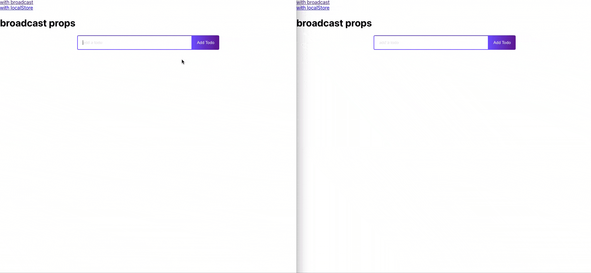

# Implementation and use of Package hook-cross-tab
 * [spanish version](./readmes/README(es).md)



[link of this demo](https://josermarinr.github.io/example-hook-cross-tab/)

if you clone this repo

install all dependencies

```
npm i
```

the use exact of package is 

```
 const [todos, setTodos] = UniversalState({key:"tareas",initialState: [], option: "broadcast"})
```
for know the effect without hook go to app.tsx and uncomment line 27-29 and comment the rest of line 19-24

in this repo you find two implementation, one with broadcast and other with localStorage

enjoy :blush:


by J. MARIN :anchor: