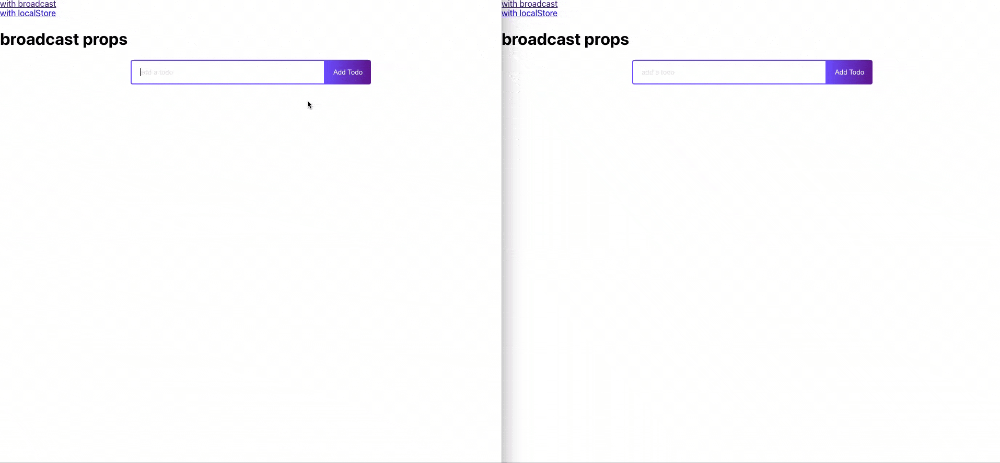

# implementacion y uso del package hook-cross-tab



[link para usar esta demostracion](https://josermarinr.github.io/example-hook-cross-tab/)

si clonas este repo

instala todas las dependencias con

```
npm i
```

el uso exacto de este hook es el siguiente

```
 const [todos, setTodos] = UniversalState({key:"tareas",initialState: [], option: "broadcast"})
```
para conocer el efecto sin hook des comenta las lineas 27-29 en app.tsx y comenta las lineas 19-24

en este repo consgues  dos tipos de implementacion broadcast y con localstorage


disfruta  :blush:


por J. MARIN :anchor: